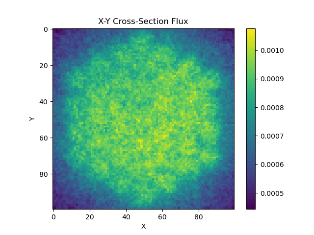

# OpenMC
Modeling reactor criticality and depletion using OpenMC library

Folders in this repository:

Tutorial_Examples:

- Tutorial using RBMK reactor geometry model. Using openmc-data_downloader to get cross-section data from ENDFB-7.1-NNDC and TENDL-2019 datasets. Conducting a criticality search to find the critical boron concentration for a given set of model parameters.
- Building a simple pincell model with spatial and energy tallies.

- Postprocessing script to read tallies and plot flux spectrum & X-Y and X-Z spatial distributions of flux, fission, and absorption.
  

Hex_Bundle_Optimization:
- Building a model for a hexagonal lattice of pincells. Enrichment is varied as a linear function of radius in order to flatten the spatial flux distribution.

 

- Create a parametric model object which takes as input the lattice pitch, total core radius, pin radius, and linear fit parameters for the enrichment distribution and outputs the flux uniformity metric and k_eff. Conduct a coarse gridsearch to identify trends in these outputs.

Depletion:
- Using the openmc.deplete functions to evaluate the behaviour of U235 & Xe135 concentrations and k_eff values in my simple pincell model over a period of 6 months.
- 
  
